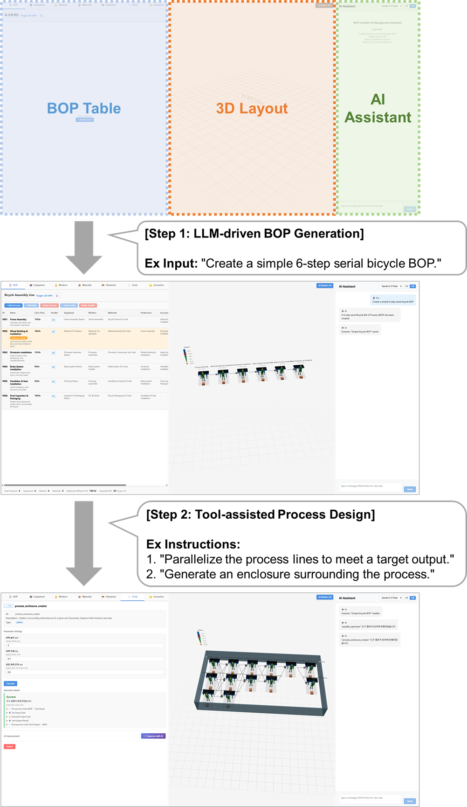

# GDP (Generative Digital-twin Prototyper)


An LLM-based framework for automated manufacturing process design and analysis tool integration.

<p align="center">
  
</p>

## Key Features

- **Zero-shot BOP Generation**: Generate structurally complete manufacturing process data (Bill of Process) from natural language input without domain knowledge
- **Three Tool Integration Modes**: Existing script adapter auto-generation (Mode A), AI-based tool logic synthesis (Mode B), and schema-guided optimization (Mode C)
- **Auto-Repair Mechanism**: LLM-based self-correction of runtime errors in tool adapters with up to k repair attempts
- **Process-Centric Data Model**: Flattened BOP structure optimized for LLM token efficiency and tool interoperability
- **Synchronized 3-Panel Interface**: BOP Table, 3D Layout, and AI Assistant with bidirectional real-time sync

## Quick Start

### Prerequisites

- Python 3.10+
- Node.js 18+
- At least one LLM API key (Gemini, OpenAI, or Anthropic)

### Installation

Download the source from [https://anonymous.4open.science/r/gdp-0D5D](https://anonymous.4open.science/r/gdp-0D5D) and extract it, then:

```bash
cd gdp
pip install -r requirements.txt
npm install
```

### Environment Setup

```bash
cp .env.example .env
# Edit .env and add your API key(s)
```

### Running

```bash
# 1. Start the backend API server
uvicorn app.main:app --reload --port 8000

# 2. Start the frontend dev server (in a separate terminal)
npm run dev
```

Open http://localhost:5173 in your browser.

## Usage

The interface consists of three synchronized panels: **Data Tables** (left), **3D Layout** (center), and **AI Assistant** (right).

### Manual Workflow

1. **Create master tables first** — Register equipment, workers, and materials in their respective tabs (Equipment / Workers / Materials) before creating processes.
2. **Create processes** — In the BOP tab, click **+ Add Process** to add process steps. Edit the name, description, and cycle time inline.
3. **Assign resources** — Use the Equipment / Workers / Materials dropdowns in each process row to map registered masters to processes.
4. **Arrange layout** — Switch to the 3D view and drag process boxes or resources to position them. Right-click to rotate (5-degree snap).

### 3D Layout Controls

**Camera:**
- **Left drag**: Rotate camera
- **Right drag**: Pan view
- **Scroll**: Zoom in/out

**Object manipulation** — Click an object to select it, then switch modes with keyboard:
- **T key** (Translate mode): Drag the axis handles to move on the XZ plane
- **R key** (Rotate mode): Drag the green rotation ring to rotate (5-degree snap)

### Tool Registration & Execution

GDP supports three ways to add analysis tools in the **Tools** tab:

- **Upload** — Click **+ Upload**, select a Python script (`.py`), and the system auto-analyzes input/output schemas and generates an adapter.
- **AI Generate** — Click **AI Generate**, describe the desired analysis in natural language, and the system generates both the schema and script.
- **AI Improve** — After running a tool, expand the **AI Improve** section to refine the adapter, parameters, or script with feedback.

To execute a registered tool, select it from the list, configure parameters if needed, and click **Execute**. Results are shown as a diff — click **Apply Changes** to update the BOP.

### AI Assistant

The right panel accepts natural language commands. Select a model and language (KR/EN), then type instructions. Examples:

- `"Create a bicycle assembly line with 5 processes"`
- `"Add an inspection process after welding"`
- `"Delete process P003"`
- `"What is the current bottleneck?"`

The assistant can generate a full BOP from scratch, modify existing processes, answer questions, and invoke registered tools.

### Scenarios

In the **Scenarios** tab you can save, load, compare, and export your work:

- **Save/Load** — Save the current BOP as a named scenario and reload it later.
- **Compare** — Select multiple scenarios to compare process count, UPH, and resource usage side by side.
- **Export** — Download the BOP as JSON or Excel. Upload a previously exported file to restore it.

## Project Structure

```
gdp/
├── app/                          # FastAPI backend
│   ├── main.py                   # API endpoints
│   ├── llm_service.py            # LLM orchestration
│   ├── llm/                      # LLM provider implementations
│   └── tools/                    # Tool adapter system
├── src/                          # React frontend source
├── dist/                         # Pre-built frontend
├── public/models/                # 3D model assets (GLB)
├── data/tool_registry/           # Registered analysis tools (12 tools)
├── uploads/scripts/              # Tool scripts
├── tests/                        # Test suite
└── experiments/                  # Reproducible experiment code
    ├── ex1_zero_shot_generation/ # Experiment 1: Zero-shot BOP generation
    ├── ex2_adapter_auto_repair/  # Experiment 2: Adapter auto-repair
    └── ex3_design_efficiency/    # Experiment 3: Design task efficiency
```

## Experiments

### Experiment 1: Zero-Shot Process Generation Performance

Evaluates zero-shot BOP generation across **10 manufacturing product families** (83 GT steps) with 4 LLMs. Three models achieve an average **F1 of 88.9%** under N:M coverage matching.

```bash
# Quick test (1 product, cheap models)
python experiments/ex1_zero_shot_generation/run_experiment.py --test

# Full experiment (all models, all products)
python experiments/ex1_zero_shot_generation/run_experiment.py
```

### Experiment 2: Automatic Adapter Generation and Auto-Repair

Tests **10 analysis tools** across **8 BOP scenarios** with repair budgets k=0..3 (320 runs total). Auto-Repair achieves **100% execution pass rate** at k=2, while two-tier evaluation reveals **16.2% silent failures**.

```bash
# Quick test (1 tool, 1 BOP)
python experiments/ex2_adapter_auto_repair/run_experiment.py --test

# Full experiment (320 runs)
python experiments/ex2_adapter_auto_repair/run_experiment.py
```

### Experiment 3: Design Task Efficiency Evaluation

Five engineers (3–15 years experience) perform the same E-Bike assembly line design task (6-process BOP setup + bottleneck parallelization to meet 100 UPH) under two conditions: manual editing vs. AI-assisted generation. AI-assisted design reduces time by **55.2%** with consistent completion (SD 0.7 min).

See [experiments/ex3_design_efficiency/](experiments/ex3_design_efficiency/) for task instructions and details.

## Pre-registered Analysis Tools

GDP includes 10 manufacturing analysis tools from Experiment 2, ready to use in the web interface:

| Tool | Difficulty | Description |
|------|-----------|-------------|
| Bottleneck Analyzer | Easy | Identifies bottleneck process by effective cycle time |
| Line Balance Calculator | Easy | Computes line balance rate and takt time |
| Equipment Utilization | Medium | Analyzes equipment utilization and overload |
| Material Flow Analyzer | Medium | Tracks material flows with quantity aggregation |
| Process Distance Analyzer | Medium | Calculates material flow distances |
| Safety Zone Checker | Medium | Validates process-to-obstacle safety distances |
| Worker Skill Matcher | Medium | Evaluates worker-to-process skill alignment |
| Energy Estimator | Hard | Computes energy consumption and cost |
| Layout Compactor | Hard | Compacts process layout while maintaining gaps |
| Takt Time Optimizer | Hard | Optimizes parallel stations to achieve target UPH |

## 3D Asset Licenses

This project uses 3D models under CC0 1.0 / public domain licenses.

## Citation

```bibtex
@inproceedings{anonymous2026gdp,
  title     = {GDP (Generative Digital-twin Prototyper): An LLM-Based Framework
               for Automated Process Design and Analysis Tool Integration},
  author    = {Anonymous},
  booktitle = {Proc. IEEE Int. Conf. Autom. Sci. Eng. (CASE)},
  year      = {2026}
}
```

## License

[MIT](LICENSE)
