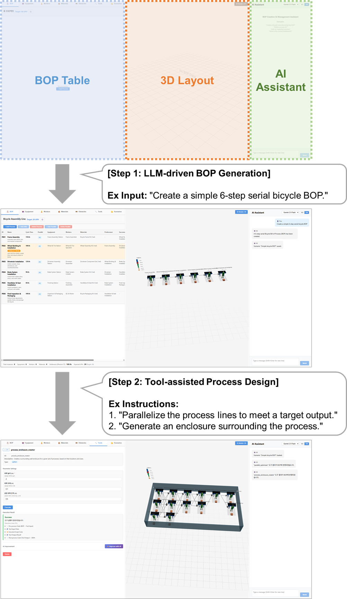

# GDP (Generative Digital-twin Prototyper)

[English](README.md) | [한국어](README_KR.md)

LLM 기반 제조 공정 자동 설계 및 분석 도구 통합 프레임워크

<p align="center">
  
</p>

GDP는 제조 전문 지식이 부족한 사용자도 대규모 언어 모델(LLM)과의 자연어 대화를 통해 생산 라인 공정(Bill of Process)을 설계할 수 있게 하며, **Auto-Repair** 메커니즘을 통해 실행 오류 발생 시 생성 코드를 자동 수정하여 분석 도구를 통합합니다.

## 주요 기능

- **Zero-Shot BOP 생성**: LLM 사전 지식을 활용하여 제품명만으로 완전한 Bill of Process 구조 생성
- **3D 시각화**: React Three Fiber 기반의 인터랙티브 브라우저 3D 공장 레이아웃
- **멀티 LLM 지원**: Gemini, GPT, Claude 모델 계열 지원
- **도구 어댑터 Auto-Repair**: LLM이 생성한 분석 어댑터의 실행 실패 시 반복적 자가 수리
- **10개 내장 분석 도구**: 병목 분석, 라인 밸런싱, 에너지 추정, 레이아웃 최적화 등
- **다국어 UI**: 한국어 / 영어 인터페이스 (i18n 지원)
- **BOP 가져오기/내보내기**: JSON 및 Excel 형식 지원

## 빠른 시작

### 사전 요구사항

- Python 3.10+
- Node.js 18+
- LLM API 키 최소 1개 (Gemini, OpenAI, 또는 Anthropic)

### 설치

```bash
git clone https://github.com/lee-geon-chang/gdp.git
cd gdp

# 백엔드 의존성
pip install -r requirements.txt

# 프론트엔드 의존성
npm install
```

### 환경 설정

```bash
cp .env.example .env
# .env 파일을 편집하여 API 키를 입력하세요
```

### 실행

```bash
# 백엔드 시작 (FastAPI)
uvicorn app.main:app --reload --port 8000

# 프론트엔드 개발 서버 시작 (다른 터미널에서)
npm run dev
```

브라우저에서 http://localhost:5173 을 엽니다. 사전 빌드된 프론트엔드는 `dist/` 폴더에서 정적 서빙으로도 사용할 수 있습니다.

## 사용법

### 수동 공정 설계

1. **마스터 테이블 생성**
   - **Equipment 탭**: "+ Add" 버튼으로 설비 추가 (robot / machine / manual_station)
   - **Workers 탭**: "+ Add" 버튼으로 작업자 추가 및 스킬 레벨 설정
   - **Materials 탭**: "+ Add" 버튼으로 자재 추가 및 단위 설정

2. **공정 생성 및 리소스 매핑**
   - **BOP 탭**: "+ Add Process"로 공정 추가
   - 공정 행을 클릭하여 펼친 후, 드롭다운 메뉴에서 리소스(설비/작업자/자재) 배정
   - Predecessor / Successor로 공정 순서 연결
   - "Parallel Line"으로 병렬 공정 구성

3. **3D 레이아웃 조작**
   - 마우스 좌클릭 드래그: 카메라 회전
   - 마우스 우클릭 드래그: 카메라 이동 (Pan)
   - 스크롤: 줌 인/아웃
   - 객체 클릭 후:
     - **T** 키: 이동 모드 (축 화살표 드래그)
     - **R** 키: 회전 모드 (빨간 링 드래그, 5도 단위 스냅)
     - **S** 키: 크기 조절 모드

### AI 활용 설계

- **AI Assistant** 패널에서 자연어로 요청 입력
- 예시: *"6단계 자전거 조립 BOP를 생성해줘"*
- LLM이 공정, 설비, 작업자, 자재를 자동 생성
- 생성 후 수동 편집으로 미세 조정 가능

### 도구 연동

- **Tools** 탭에서 분석 도구 관리
- **Upload**: 기존 Python 스크립트 업로드 → 어댑터 자동 생성
- **AI Generate**: 자연어로 분석 도구 설명 → 도구 자동 생성
- **Execute**: 파라미터 설정 후 실행 → 결과가 BOP에 반영
- **Auto-Repair**: 실행 에러 시 자동 수정 후 재실행

### 가져오기 / 내보내기

- **Scenarios** 탭에서 데이터 관리
- JSON 또는 Excel 형식으로 BOP 데이터 내보내기/가져오기
- 시나리오 저장, 불러오기, 비교

## 프로젝트 구조

```
gdp/
├── app/                          # 백엔드 (FastAPI)
│   ├── main.py                   # API 엔드포인트
│   ├── models.py                 # BOP 데이터 모델
│   ├── prompts.py                # LLM 시스템 프롬프트
│   ├── llm_service.py            # LLM 오케스트레이션
│   ├── llm/                      # LLM 프로바이더 구현
│   └── tools/                    # 도구 어댑터 시스템
├── src/                          # 프론트엔드 (React + Three.js)
│   ├── components/               # UI 컴포넌트
│   ├── services/                 # API 클라이언트
│   ├── store/                    # Zustand 상태 관리
│   ├── i18n/                     # 국제화
│   └── data/                     # 정적 데이터 및 3D 모델 레지스트리
├── public/models/                # 3D 모델 에셋 (GLB)
├── dist/                         # 사전 빌드된 프론트엔드
├── experiments/                  # 재현 가능한 실험 코드
│   ├── ex1_zero_shot_generation/ # 실험 1: Zero-shot BOP 생성
│   ├── ex2_adapter_auto_repair/  # 실험 2: 어댑터 Auto-Repair
│   └── ex3_design_efficiency/    # 실험 3: 설계 효율성 (예정)
└── tests/                        # 테스트 코드
```

## 실험

이 저장소에는 논문에서 사용된 실험 코드와 결과가 포함되어 있습니다.

### 실험 1: Zero-Shot BOP 생성

제품명만으로 LLM이 얼마나 정확하게 공정 구조를 생성할 수 있는지 평가합니다. 5개 LLM을 10개 제품 카테고리에 대해 인간이 큐레이션한 정답(Ground Truth)과 N:M 커버리지 매칭으로 비교합니다.

> [experiments/ex1_zero_shot_generation/](experiments/ex1_zero_shot_generation/)

### 실험 2: 어댑터 Auto-Repair

LLM이 생성한 도구 어댑터의 반복적 자가 수리 효과를 측정합니다. 10개 도구와 8개 BOP 시나리오에 걸쳐 320회 실행하며, Pass@1 (베이스라인) 대비 최대 3회 수리 반복의 Pass@k를 비교합니다.

> [experiments/ex2_adapter_auto_repair/](experiments/ex2_adapter_auto_repair/)

### 실험 3: 설계 효율성

GDP 사용 시 수동 BOP 설계 대비 전체 설계 시간 단축 효과를 평가할 예정입니다.

> [experiments/ex3_design_efficiency/](experiments/ex3_design_efficiency/)

## 3D 에셋 라이선스

이 프로젝트는 다음 3D 모델을 사용합니다. 제작자분들께 감사드립니다:

| 에셋 | 제작자 | 라이선스 |
|------|--------|----------|
| [Conveyor Kit](https://kenney.nl/assets/conveyor-kit) | Kenney | CC0 1.0 |
| [Animated Characters 2](https://kenney.nl/assets/animated-characters-2) | Kenney | CC0 1.0 |
| [Kuka Robot Arm](https://sketchfab.com/3d-models/kuka-robot-arm-6c05d2bf8bdf4c5ea10766ccb8ae3a9a) | Odvokara | CC-BY-4.0 |
| [Avatar Safety Uniform](https://sketchfab.com/3d-models/avatar-safety-uniform-f13bf52e0e004c6593adcd6ddc3bb92b) | Nyayata | CC-BY-4.0 |
| [VENTIS 3015 AJ](https://sketchfab.com/3d-models/ventis-3015-aj-6d5eb83d3a994252874b2a12e0c99855) | vexhibition | CC-BY-4.0 |
| [Simple Rubber Conveyor](https://sketchfab.com/3d-models/simple-rubber-conveyor-d52b94e18e4c4ebab08f2306eb95e899) | scailman | CC-BY-4.0 |
| [Larger Resource Box](https://sketchfab.com/3d-models/larger-resource-box-5c8eeb4b3e744e93b8e6e0e55c6d76c1) | Erroratten | CC-BY-4.0 |

## 인용

이 코드를 연구에 사용하시는 경우 다음과 같이 인용해 주세요:

```bibtex
@inproceedings{lee2026gdp,
  title     = {{GDP} (Generative Digital-twin Prototyper): An {LLM}-Based Framework
               for Automated Process Design and Analysis Tool Integration},
  author    = {Lee, Geonchang and Hong, Gildong},
  booktitle = {Proc. IEEE Int. Conf. Automation Science and Engineering (CASE)},
  year      = {2026}
}
```

## 라이선스

이 프로젝트는 MIT 라이선스로 배포됩니다. 자세한 내용은 [LICENSE](LICENSE)를 참조하세요.
